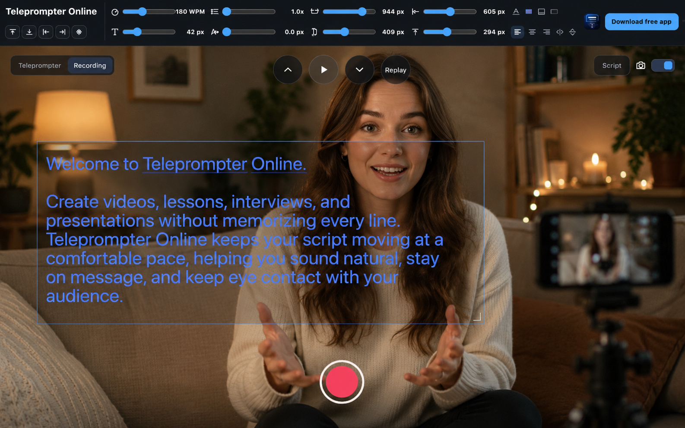

# Teleprompter Online

[English](README.md) · [简体中文](README.zh-CN.md)



Teleprompter Online helps creators, educators, founders, and presenters speak naturally while reading from a script. It runs directly in the browser with no build step, supports a clean prompter view, and includes a recording layout with a 16:9 camera preview and adjustable text overlay.

[Open Teleprompter Online](https://teleprompter.works) · [Download the free iPhone, iPad, and Mac app](https://apps.apple.com/app/teleprompter-scrolling-scripts/id6767148844)

## Overview

This repository contains the lightweight web version of Teleprompter. It is designed for TikTok, Reels, YouTube videos, presentations, online courses, interviews, demos, and other scripted content.

The web app is intentionally simple: static `HTML`, `CSS`, and `JavaScript`, with local browser storage for settings and no runtime dependencies.

Open-source browser teleprompter for [teleprompter.works](https://teleprompter.works).

## Features

- Teleprompter mode for smooth full-screen script reading.
- Recording mode with a centered 16:9 camera preview.
- Draggable and resizable script overlay in recording mode.
- Scroll speed control from 10 to 500 WPM.
- Text size, line spacing, letter spacing, color, background, alignment, and mirror controls.
- Web-friendly preset layouts for top, bottom, left, right, and center placement.
- Voice control commands in teleprompter mode.
- Local settings persistence with `localStorage`.
- Static deployment with no build step.

## Quick Start

Clone the repository:

```bash
git clone https://github.com/wendy7756/teleprompter-online.git
cd teleprompter-online
```

Serve the folder locally:

```bash
python3 -m http.server 8787
```

Open:

```text
http://localhost:8787
```

You can also open `index.html` directly, but serving the folder is recommended because browser camera permissions behave more reliably on `localhost`.

## Project Structure

```text
.
├── assets/
│   ├── logo.svg
│   └── readme-preview.png
├── app.js
├── index.html
├── styles.css
├── LICENSE
├── README.md
└── README.zh-CN.md
```

## Deployment

This is a static website and can be deployed to any static host:

- Cloudflare Pages
- GitHub Pages
- Netlify
- Vercel
- Any static file server

For production camera and microphone access, deploy over HTTPS.

## Browser Support

Modern Chromium, Safari, and Firefox browsers can run the teleprompter interface. Camera recording depends on browser support for:

- `getUserMedia`
- `MediaRecorder`
- Canvas capture

Recorded videos are exported as `.webm` when supported by the browser.

## Native App

The native Teleprompter app is available for iPhone, iPad, and Mac:

[Download Teleprompter on the App Store](https://apps.apple.com/app/teleprompter-scrolling-scripts/id6767148844)

The native app is distributed separately. This repository covers the open-source online/web portion of Teleprompter.

## Contributing

Issues and pull requests are welcome. For UI changes, please keep the app lightweight, responsive, and dependency-free unless a dependency clearly improves the core experience.

Before opening a pull request:

```bash
node --check app.js
python3 -m http.server 8787
```

Then test the main flows in a browser:

- Edit script
- Teleprompter playback
- Recording mode layout
- Camera toggle
- Overlay drag and resize

## License

This project is licensed under the terms in [LICENSE](LICENSE).
